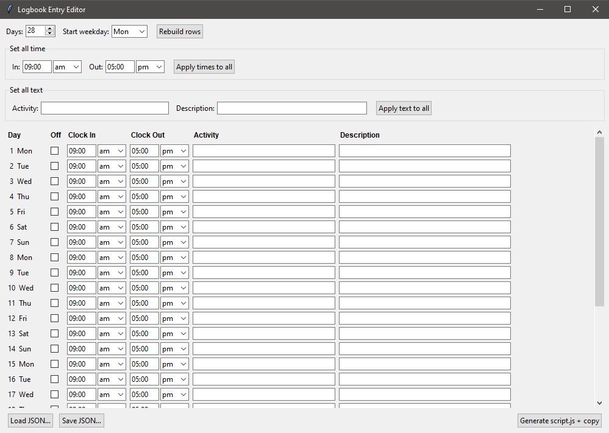

## Requirements

- Python 3.x (tkinter ships with the standard installer — no `pip install` needed)

## 1. Run the UI

```bash
python logbook_ui.py
```

## 2. Build your entries

1. **Days** — number of logbook rows. **Start weekday** — weekday of day 1.
   Click **Rebuild rows** to regenerate the table.
2. Per row, set **Clock In** / **Clock Out** (time text + `am`/`pm` selector),
   **Activity**, and **Description**.
3. Tick **Off** on any day that should be marked OFF (its fields disable; the
   script clicks the Off button for that row).
4. Shortcuts:
   - **Set all time** → fill In/Out + am/pm → **Apply times to all**.
   - **Set all text** → fill Activity/Description → **Apply text to all**.
   - Both skip Off rows. Tweak individual rows afterward.
5. *(Optional)* **Save JSON…** to keep your values, **Load JSON…** to reload them later.

> Row order must match the row order on the logbook page (top to bottom).

## 3. Generate the script

Click **Generate script.js + copy**. This:

- writes `script.generated.js` next to the UI, and
- copies the full script to your clipboard.

## 4. Run it on the target site

1. Open the logbook page in your browser, on the month/view that shows the rows.
2. Open DevTools console: `F12` (or `Ctrl+Shift+J`), go to the **Console** tab.
3. If the console asks, type `allow pasting` and press Enter.
4. Paste (`Ctrl+V`) the script and press **Enter**.

The script clicks each row's detail button, fills the fields (or marks OFF), and
submits — one row per `entries[]` element, in order.

## Notes

- Selector targets the **submit** buttons (`.button.button-primary.detailsbtn`).
  To target **edit** buttons instead, swap to the commented `.button-orange`
  line inside the generated script.
- Time values are always well-formed (`09:00 am`) because am/pm is a selector,
  not free text.
- `script.js` is a hand-editable template; `script.generated.js` is overwritten
  every time you click Generate.